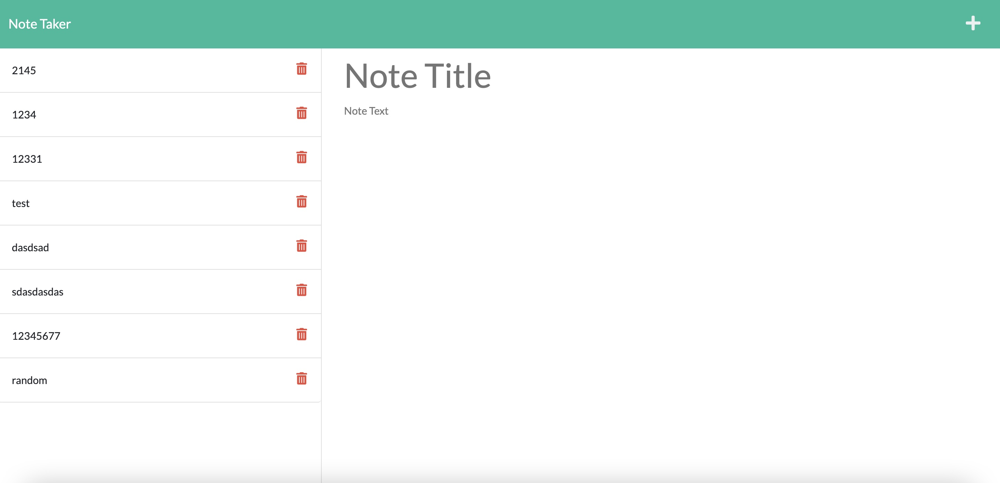

# Note Taker Starter Code

This application's functionality resembles that of the default Notes App by Apple Inc. The user can add, save, delete, and manage their notes through this app. 

The application was created with the Express package to host a server that holds the data for the notes' contents. 

Preview:

The application is hosted here:
[https://whispering-garden-06498.herokuapp.com/](https://whispering-garden-06498.herokuapp.com/)

